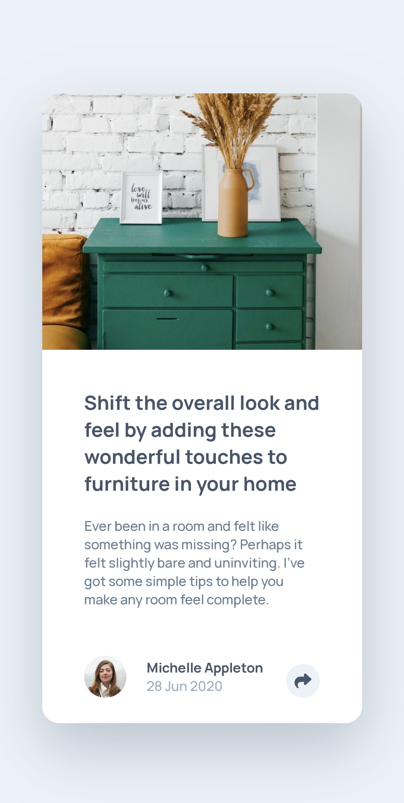

# Frontend Mentor - Article preview component solution

This is a solution to the [Article preview component challenge on Frontend Mentor](https://www.frontendmentor.io/challenges/article-preview-component-dYBN_pYFT).


## Table of contents

- [Overview](#overview)
  - [Screenshot](#screenshot)
  - [Links](#links)
- [My process](#my-process)
  - [Built with](#built-with)
  - [What I learned](#what-i-learned)
  - [Useful resources](#useful-resources)
- [Author](#author)

## Overview

### The challenge

Users should be able to:

- View the optimal layout for the interface depending on their device's screen size

### Screenshot





### Links

- Solution URL: [Github repo](https://github.com/b16h22/article_preview_component_solution)
- Live Site URL: [Github pages](https://b16h22.github.io/article_preview_component_solution/)

## My process

### Built with

- Semantic HTML5 markup
- CSS custom properties
- Flexbox
- Javascript

### What I learned

Learned to access the HTML DOM elements by their id.

```js
let shareButton = document.getElementById("share");
```
Invoke a function when clicking on a button/image.

```js
shareButton.onclick = openPopup;

function openPopup() {
  if (sharePopup.style.display == "none") {
    sharePopup.style.display = "flex";
  } else {
      sharePopup.style.display = "none";
    }
  }
```
### Useful resources

- [HTML DOM Elements](https://www.w3schools.com/js/js_htmldom_elements.asp) - This helped me learn about HTML DOM elements and methods to access them.
- [HTML DOM Events](https://www.w3schools.com/js/js_htmldom_events.asp) - Helped me learn about events and reacting to events.

## Author

- Frontend Mentor - [@b16h22](https://www.frontendmentor.io/profile/b16h22)
